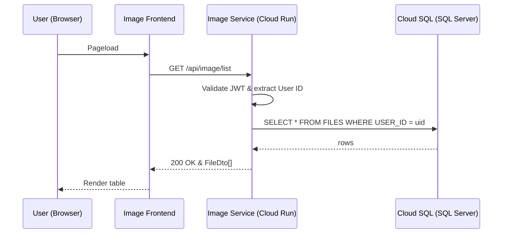

```mermaid
sequenceDiagram
    participant U   as User (Browser)
    participant NG  as Image Frontend
    participant IMG as Image Service (Cloud Run)
    participant DB  as Cloud SQL (SQL Server)
    U->>NG: Pageload
    NG->>IMG: GET /api/image/list
    IMG->>IMG: Validate JWT & extract User ID
    IMG->>DB: SELECT * FROM FILES WHERE USER_ID = uid
    DB-->>IMG: rows
    IMG-->>NG: 200 OK & FileDto[]
    NG-->>U: Render table
```