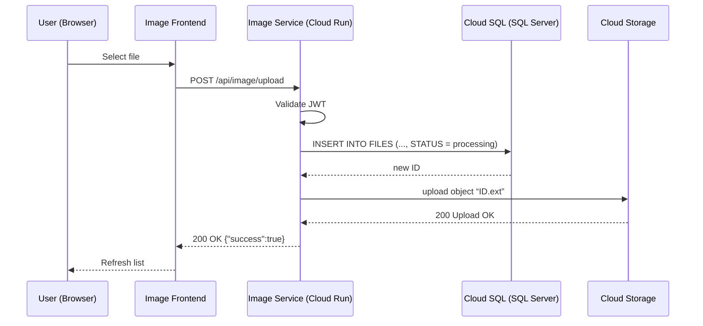

```mermaid
sequenceDiagram
    participant U   as User (Browser)
    participant NG  as Image Frontend
    participant IMG as Image Service (Cloud Run)
    participant DB  as Cloud SQL (SQL Server)
    participant GCS as Cloud Storage
    U->>NG: Select file 
    NG->>IMG: POST /api/image/upload  
    IMG->>IMG: Validate JWT 
    IMG->>DB: INSERT INTO FILES (..., STATUS = processing)
    DB-->>IMG: new ID
    IMG->>GCS: upload object “ID.ext”
    GCS-->>IMG: 200 Upload OK
    IMG-->>NG: 200 OK {"success":true}
    NG-->>U: Refresh list
```